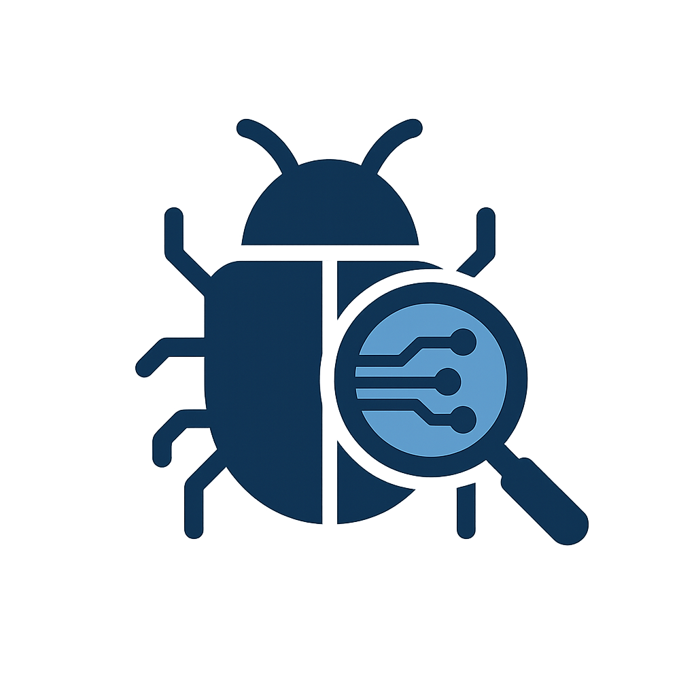

# CVE Search Engine

[](https://github.com/YOUR_USERNAME/cve-search-app)

An AI-powered CVE (Common Vulnerabilities and Exposures) search application. Users can enter natural language queries to find relevant CVEs from the NVD dataset.

Built with Next.js, Supabase, Python, Together AI (via Vercel AI SDK), and Tailwind CSS.

[**Features**](#features) · [**Tech Stack**](#tech-stack) · [**Project Architecture**](#project-architecture) · [**Setup and Running**](#setup-and-running)

---
## Features
- **Natural Language CVE Search**: Users can type queries like "critical vulnerabilities in Apache from last month" to find CVEs.
- **AI-Powered Query Translation**: Leverages a Large Language Model (LLM) via Together AI and the Vercel AI SDK to translate natural language into structured SQL query parameters.
- **Supabase Integration**: Uses Supabase for PostgreSQL database storage of CVE data and for executing dynamic SQL queries.
- **Targeted Data**: Searches against a pre-processed and enriched subset of NVD CVE data stored in the `rich_cve_entries` view.
- **Responsive UI**: Built with Next.js, React Server Components, and Shadcn/UI (Tailwind CSS).

## Tech Stack
- **Frontend**: [Next.js](https://nextjs.org) (App Router, React Server Components, Server Actions)
- **Styling**: [Tailwind CSS](https://tailwindcss.com) with [Shadcn/UI](https://ui.shadcn.com) components
- **AI Integration**:
  - [Vercel AI SDK](https://sdk.vercel.ai/docs) for managing LLM interactions.
  - [Together AI](https://www.together.ai/) as the LLM provider (currently configured for Qwen models, but adaptable).
- **Backend/Database**: [Supabase](https://supabase.io) (PostgreSQL for CVE data storage, custom SQL functions for dynamic queries).
- **Data Ingestion**: Python script (`supabase/connect_db.py`) using `supabase-py` and `python-dotenv` to process NVD JSON data and load it into Supabase.
- **Language**: TypeScript

## Project Architecture
The project consists of two main parts:

### 1. Data Ingestion (Python)
- **Location**: `supabase/` directory.
- **Script**: `connect_db.py`
- **Purpose**:
  - Reads NVD CVE JSON data (e.g., `data/nvdcve-1.1-2025.json`).
  - Connects to the Supabase database.
  - Upserts CVE entries into the `cve_entries` table.
  - **Data Source**: The `rich_cve_entries` SQL VIEW in Supabase is then used as the primary source for the application. This view filters for CVEs with more complete information (description, problem type, references, impact).

### 2. Next.js Application (CVE Search UI & API)
- **Location**: Root directory (`cve-search-app/`)
- **Key Components**:
  - `app/page.tsx`: The main search interface.
  - `app/actions.ts`: Contains the primary server action `searchCVEsAction`. This action:
    - Takes a natural language query from the user.
    - Uses the Vercel AI SDK and Together AI (LLM) to convert the query into structured arguments for a predefined "tool" (`searchCVEsTool`).
    - Translates these structured arguments into SQL `WHERE` clauses.
    - Calls a Supabase SQL function `public.execute_sql(sql_query TEXT)` to run the dynamic query against the `rich_cve_entries` view.
    - Returns the search results to the frontend.
  - `utils/supabase/`: Supabase client and server client setup.
  - `components/ui/`: Reusable UI components from Shadcn/UI.

## Setup and Running

### Prerequisites
- Node.js and pnpm (or npm/yarn)
- Python 3.x
- Access to a Supabase project
- A Together AI API key

### 1. Environment Variables
Create a `.env.local` file in the root of the `cve-search-app` directory with the following variables:
```env
TOGETHER_API_KEY=your_together_ai_api_key
NEXT_PUBLIC_SUPABASE_URL=your_supabase_project_url
NEXT_PUBLIC_SUPABASE_ANON_KEY=your_supabase_anon_key
SUPABASE_SERVICE_ROLE_KEY=your_supabase_service_role_key
```
Replace the placeholder values with your actual credentials.

### 2. Setup Supabase
#### a. Create Tables and Views
Ensure the `cve_entries` table and the `rich_cve_entries` view are set up in your Supabase database. The schema for `cve_entries` should match the structure of the NVD CVE JSON data. The `rich_cve_entries` view is defined as:
```sql
CREATE OR REPLACE VIEW rich_cve_entries AS SELECT id, cve_id, assigner, problem_type_data, references_data, description_text, description_data_full, configurations_data, impact_data, published_date, last_modified_date, raw_cve_item, created_at, updated_at FROM cve_entries WHERE (problem_type_data IS NOT NULL AND problem_type_data -> 0 -> 'description' -> 0 IS NOT NULL) AND (description_text IS NOT NULL AND description_text != '') AND (references_data IS NOT NULL AND references_data -> 0 IS NOT NULL) AND (impact_data IS NOT NULL AND impact_data::text != '{}');
```
#### b. Create the `execute_sql` Function
In your Supabase SQL Editor, run the following to create the necessary SQL function:
```sql
CREATE OR REPLACE FUNCTION public.execute_sql(sql_query TEXT) RETURNS TABLE ( cve_id TEXT, description_text TEXT, published_date TIMESTAMPTZ, last_modified_date TIMESTAMPTZ, assigner TEXT, impact_data JSONB, references_data JSONB, problem_type_data JSONB ) LANGUAGE plpgsql AS $$ BEGIN RETURN QUERY EXECUTE sql_query; END; $$;
```

### 3. Data Ingestion (Python Script)
- Navigate to the `supabase` directory (relative to the project root, not `cve-search-app`).
- Create a Python virtual environment and install dependencies:
```bash
cd ../supabase # Assuming you are in cve-search-app
python -m venv .venv
source .venv/bin/activate # On Windows: .venv\Scripts\activate
pip install -r requirements.txt
```
- Ensure your NVD JSON data (e.g., `nvdcve-1.1-2025.json`) is in the `supabase/data/` directory.
- Create a `.env` file inside the `supabase` directory with your Supabase credentials (this is separate from the Next.js `.env.local` but can contain some of the same Supabase variables if you prefer, or just the ones the Python script needs):
```env
NEXT_PUBLIC_SUPABASE_URL="your_supabase_project_url" # Or just SUPABASE_URL
NEXT_PUBLIC_SUPABASE_ANON_KEY="your_supabase_anon_key" # Or just SUPABASE_ANON_KEY
SUPABASE_SERVICE_ROLE_KEY="your_supabase_service_role_key"
```
- Run the ingestion script:
```bash
python connect_db.py
```

### 4. Install Next.js Dependencies
Navigate back to the `cve-search-app` directory and install the Node.js dependencies:
```bash
cd ../cve-search-app # Or just ensure you are in the cve-search-app root
pnpm install
```

### 5. Run the Next.js Application
```bash
pnpm dev
```
Your CVE Search Engine should now be running on [localhost:3000](http://localhost:3000/).

## UI Components and Project Structure

### UI Components (`components/ui/`)
The application utilizes several UI components from Shadcn/UI, located in `cve-search-app/components/ui/`. Based on `app/page.tsx`, the following are actively used:
- `Input`: For the search query input field.
- `Button`: For the search button.
- `Alert`: To display errors or informational messages.
- `Card`, `CardHeader`, `CardTitle`, `CardDescription`, `CardContent`: Used to display each CVE result and the AI query analysis. Other components like `skeleton.tsx` and `badge.tsx` might be present from the original template but may not be currently used on the main search page.

### Key Directories
- `cve-search-app/app/`: Contains the main application logic, including `page.tsx` (frontend UI) and `actions.ts` (server-side logic for search).
- `cve-search-app/components/`: Contains UI components, including the `ui` subdirectory for Shadcn components.
- `cve-search-app/utils/`: Utility functions, notably `supabase/client.ts` and `supabase/server.ts` for initializing Supabase clients.
- `supabase/` (outside `cve-search-app`): Contains the Python data ingestion script and related files.

## Contributing (Placeholder)
Feel free to contribute to the project! (Further details can be added here).

## License (Placeholder)
This project is licensed under the MIT License. (Or choose another license). 


